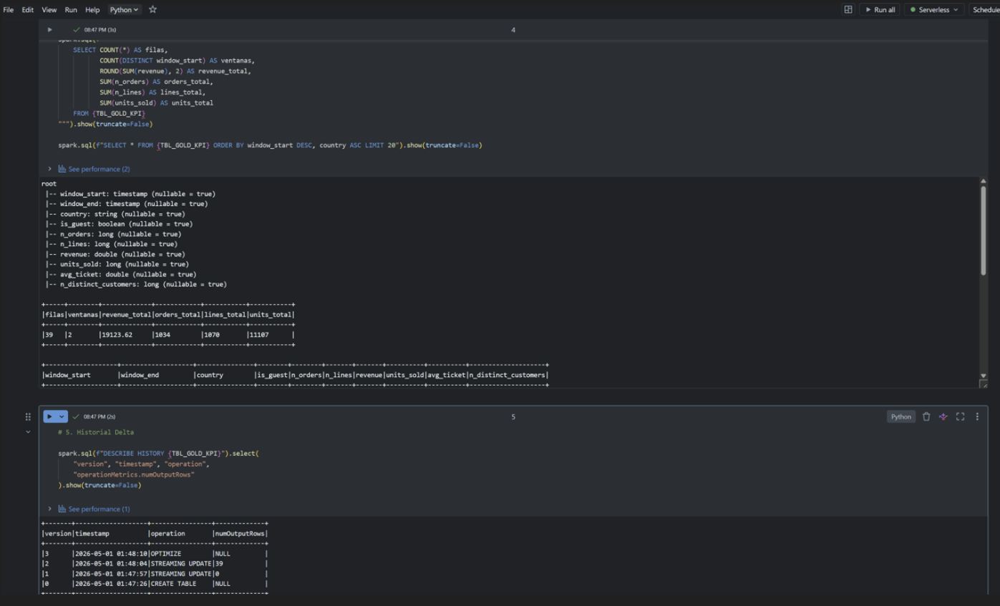
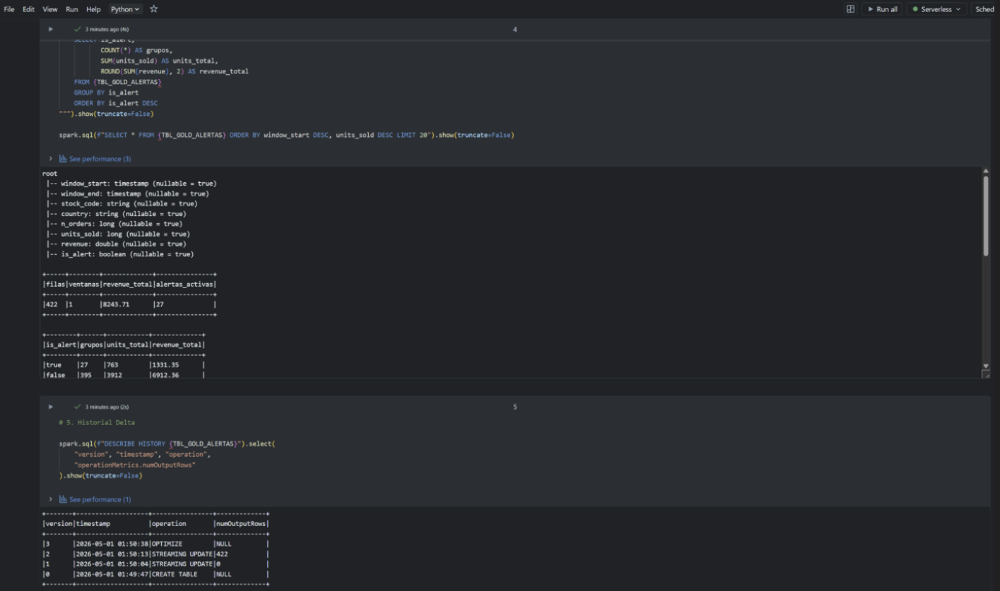
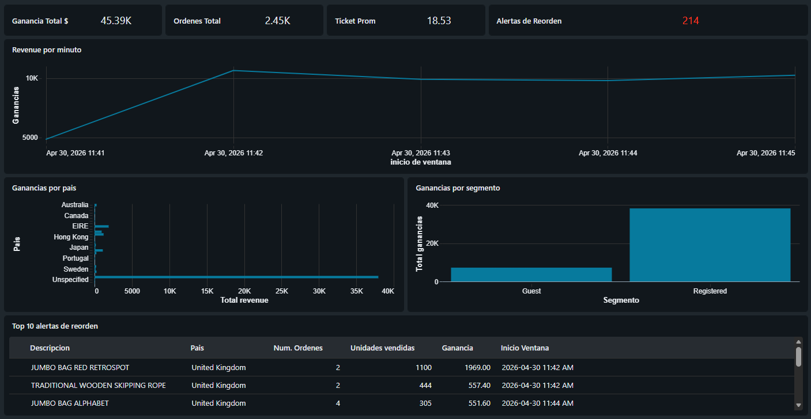

# SI7006 — Trabajo 2

## Pipeline streaming end-to-end en Databricks: monitoreo de órdenes en retail

Equipo:
- Juan José Morales
- Sebastian Ruiz
- Santiago Molano
- Daniel Pareja

Fecha: 30 de abril de 2026
Curso: SI7006 — Almacenamiento y Procesamiento de Grandes Datos
Universidad EAFIT — Maestría en Ciencia de Datos y Analítica — Cohorte 2026-1

## 1. Resumen ejecutivo

Se construyó un pipeline streaming end-to-end en Databricks Free Edition sobre el 
dataset OnlineRetail.csv, simulando órdenes vivas de e-commerce. La arquitectura 
medallion (Bronze → Silver → Gold) usa Auto Loader y Structured Streaming sobre 
Delta Lake, con dos tablas Gold derivadas en paralelo de Silver: KPIs por ventana 
y alertas de reorden de inventario. Sobre estas tablas se construyó un Dashboard 
con 8 paneles. El pipeline procesó 3,000 eventos generados durante 5 minutos y retorno 
$45,389.10 en revenue agregado por ventana, con trazabilidad del 80% respecto a la suma 
de control de Silver, el 20% restante corresponde a ventanas en cola.

## 2. Caso de uso

Monitoreo en tiempo real de órdenes. El pipeline 
ingesta eventos de venta de forma continua, limpia y enriquece, y produce 
KPIs por ventana de tiempo y alertas de reorden de inventario. 
La fuente es el dataset `OnlineRetail.csv`, un histórico real 
de ~541,909 transacciones.

## 3. Arquitectura

```
OnlineRetail.csv
│
▼
Productor Python  ──►  /Volumes/.../stream_input/*.json
│
▼
Auto Loader (Trigger.AvailableNow)
│
▼
orders_bronze (Delta + metadata)
│
▼
orders_silver (Delta limpio)
│
▼
gold_kpi_ventana   gold_alertas_reorder (Delta)
│
▼
AI/BI Dashboard de Databricks
```

### Decisiones de diseño

| Decisión | Justificación |
|---|---|
| OnlineRetail.csv como fuente | Mencionado en el enunciado, sin credenciales |
| Lotes de 50 eventos por JSON | Evita el "small files problem" en Delta |
| Auto Loader (`cloudFiles`) | Manejo nativo de archivos incrementales y schema |
| `Trigger.AvailableNow` + loop Python | Free Edition serverless no soporta triggers infinitos |
| Reescribir `InvoiceDate` con `now()` | Permite ventanas Gold sobre tiempos coherentes con la demo |
| `dropDuplicatesWithinWatermark` 24h | Dedup stateful con estado acotado |
| Watermark Gold corto (30s) | Tardanza propia de la capa, prioriza latencia baja |
| Conservar filas guest | Evita subestimar el ingreso total |

## 4. Implementación

### 4.1 Productor de eventos

`productor_eventos.py` carga el CSV en memoria con encoding Latin-1, mezcla el dataset 
(`random_state=42`), y en un loop genera lotes de 50 eventos cada 5 segundos. Cada lote 
sobrescribe `InvoiceDate` con el timestamp actual y se escribe como archivo JSON Lines 
en `stream_input/`. Configuración de la corrida final: 60 lotes × 50 eventos = 3,000 
eventos en 5 minutos.

### 4.2 Capa Bronze

`01_bronze_ingesta.py` configura un `readStream` con format `cloudFiles`, schema explícito 
y `schemaLocation` persistente. Enriquece cada registro con 4 columnas de auditoría: 
`ingested_at`, `source_file`, `source_file_size`, `source_file_modtime`.

El primer intento usó `trigger(processingTime="10 seconds")` y el serverless lo rechazó 
con `INFINITE_STREAMING_TRIGGER_NOT_SUPPORTED`. Se sustituyó por `trigger(availableNow=True)` 
envuelto en un loop Python. Este patrón mantiene las garantías Delta: ACID transaccional 
por pasada, exactly-once vía checkpoint, y schema enforcement.

### 4.3 Capa Silver

`02_silver_limpieza.py` lee en streaming desde `orders_bronze`, aplica filtros y enriquecimiento, 
y escribe a `orders_silver` con el mismo patrón loop + AvailableNow.

**Filtros de calidad**: cancelaciones (`InvoiceNo` empezando con `"C"`), cantidades inválidas 
(`Quantity <= 0`), precios inválidos (`UnitPrice <= 0`), `StockCode` o `InvoiceDate` nulos.

**Enriquecimiento**: `event_time` como timestamp canónico para ventanas, `total_amount` 
por línea, flag `is_guest`, e `customer_id_imputed` con `"GUEST"` cuando aplica.

**Deduplicación**: `dropDuplicatesWithinWatermark` por `(InvoiceNo, StockCode)` con watermark 
de 24 horas sobre `event_time`.

**Resultados**:

| Indicador | Valor |
|---|---|
| Filas en Silver | 2,927 |
| Filas guest | 771 |
| Suma de control `total_amount` | $56,489.82 |
| Países distintos | 32 |
| Productos distintos | 1,464 |
| Duplicados de clave de negocio | 0 |

### 4.4 Capa Gold: KPIs y alertas

Dos tablas Delta independientes, ambas construidas en streaming desde Silver
con `readStream`, `writeStream`, `outputMode("append")`, checkpoints propios
y watermark de 30 segundos sobre `event_time`. En ambos casos se utilizó el
patrón `Trigger.AvailableNow` dentro de un loop Python para ejecutar
micro-batches incrementales en Databricks Free Edition.

**`gold_kpi_ventana`**: tumbling window de 1 minuto, agregación por
`(window, country, is_guest)`. La tabla materializa las métricas
`n_orders`, `n_lines`, `revenue`, `units_sold`, `avg_ticket` y
`n_distinct_customers`.

Para `n_orders` y `n_distinct_customers` se utilizó
`approx_count_distinct`, ya que en agregaciones stateful de streaming
es preferible una aproximación eficiente sobre distintos exactos. El
campo `avg_ticket` se deriva como `revenue / n_orders`.

**`gold_alertas_reorder`**: tumbling window de 2 minutos, agregación por
`(window, stock_code, country)`. La tabla calcula `n_orders`,
`units_sold`, `revenue` y el flag derivado `is_alert`, que marca
`true` cuando `units_sold >= 12 AND n_orders >= 2`.

**Resultados**:

| Tabla | Filas | Ventanas | Revenue | Métricas adicionales |
|---|---:|---:|---:|---|
| `gold_kpi_ventana` | 39 | 2 | $19,123.62 | 1,034 órdenes, 1,070 líneas, 11,107 unidades |
| `gold_alertas_reorder` | 422 | 1 | $8,243.71 | 27 alertas activas |

En `gold_alertas_reorder`, de los 422 grupos materializados:

- `27` grupos (`6.4%`) cumplieron la regla de alertamiento (`is_alert = true`)
- esos grupos concentraron `763` unidades y `$1,331.35` de revenue
- los `395` grupos restantes (`93.6%`) representaron `3,912` unidades y `$6,912.36` de revenue

El esquema final de `gold_kpi_ventana` quedó compuesto por:
`window_start`, `window_end`, `country`, `is_guest`, `n_orders`,
`n_lines`, `revenue`, `units_sold`, `avg_ticket` y
`n_distinct_customers`.

El esquema final de `gold_alertas_reorder` quedó compuesto por:
`window_start`, `window_end`, `stock_code`, `country`, `n_orders`,
`units_sold`, `revenue` e `is_alert`.

**Evidencia Delta observada**:

`gold_kpi_ventana`

| Versión | Operación | Filas escritas |
|---|---|---:|
| 0 | `CREATE TABLE` | - |
| 1 | `STREAMING UPDATE` | 0 |
| 2 | `STREAMING UPDATE` | 39 |
| 3 | `OPTIMIZE` | - |

`gold_alertas_reorder`

| Versión | Operación | Filas escritas |
|---|---|---:|
| 0 | `CREATE TABLE` | - |
| 1 | `STREAMING UPDATE` | 0 |
| 2 | `STREAMING UPDATE` | 422 |
| 3 | `OPTIMIZE` | - |

Estos resultados muestran que ambas tablas Gold quedaron correctamente
materializadas como salidas Delta en streaming, con commits auditables
en el historial transaccional y listas para ser consumidas desde SQL
y dashboards.





### 4.5 Visualización en Dashboard

Dashboard `SI7006_T2_Dashboard` como página única con 8 widgets sobre 8 datasets SQL contra 
Unity Catalog. Refresh manual.

Layout: fila 1 con 4 KPI cards (Ganacia Total, Órdenes Total, Ticket Promedio, Alertas); fila 2 
con line chart de Ganancias por Minuto; fila 3 con bar chart de Ganancias por País + bar chart 
Invitado/Registrado; fila 4 con tabla de Top 10 Alertas.



## 5. Reconciliación y validación

Silver → Gold: 80.35% del revenue se materializa en ventanas cerradas. El 19.65% restante 
($11,100.72) corresponde a la última ventana abierta. La suma $45,389.10 + $11,100.72 = $56,489.82, 
demostran que no hay pérdida de datos.

## 6. Referencias

- Material del curso SI7006 (sesiones 1 a 6).
- Repositorio del curso: https://github.com/si7006eafit/si7006-261
- OnlineRetail (UCI): https://archive.ics.uci.edu/dataset/352/online+retail